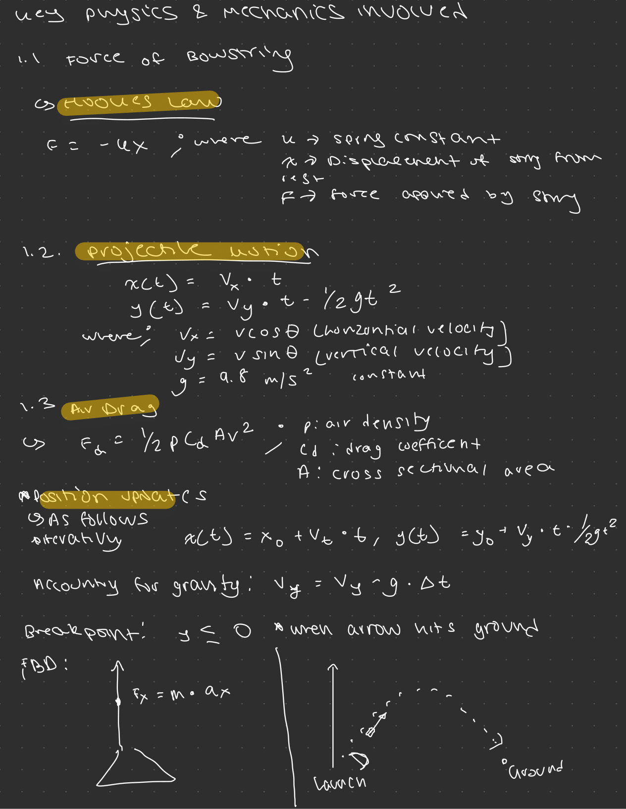

# bow & arrow projectile simulation  

2D bow and arrow projectile simulation built w/ C++, OpenGL, & GLUT. This project visualizes basic physics principles like projectile motion, gravity, and trajectory adjustments in an interactive simulation.

## C++ OpenGL Code Execution on macOS (Apple Silicon)

**Compilation & Execution Flow:**

+---------------+ --> +--------+ --> +-------+ +----------+ --> +-------+ --> +-----+ +-----------+ --> +-------+
| Source (.cpp) |     | Clang  |     | Object| |Libraries|     |Linker |     | Exec| |macOS + GPU|     |Display|
|               |     |        |     | (.o)  | (.dylib/.framework) |       |utable| |Drivers    |     |       |
+---------------+ --> +--------+ --> +-------+ +----------+ --> +-------+ --> +-----+ +-----------+ --> +-------+

**Key Elements:**

* **Clang:** C++ compiler translating source to machine code.
* **.o (Object):** Intermediate machine code, architecture-specific.
* **.dylib/.framework:** Pre-built library/framework code (GLUT, OpenGL, C++).
* **Linker:** Combines object code and libraries into an executable.
* **Executable (Arm64):** Machine code for the M2's Arm64 architecture.
* **macOS + GPU Drivers:** Operating system and graphics drivers handle execution and rendering.
* **Display:** Output to the screen.

**Concise Running Explanation:**

Code (.cpp) --> Clang (Arm64) --> Object (.o) + Libraries --> Linker --> Executable --> macOS + GPU Drivers --> Display

**System Differences (change based on OS)**

+-----------------+-----------------+-----------------+-----------------+
| Feature         | macOS (M2)      | Windows         | Linux           |
+-----------------+-----------------+-----------------+-----------------+
| Architecture    | Arm64           | x86_64 (mostly) | x86_64/Arm (var)|
| Windowing       | macOS native    | Win32/DirectX   | X11/Wayland     |
| Graphics        | OpenGL.framework| DirectX/OpenGL  | Mesa (OpenGL)   |
| Libraries       | .dylib/.framework| .dll            | .so             |
| Compiler        | Clang           | MSVC/GCC/Clang  | GCC/Clang       |
| C++ Lib         | libc++          | MSVCRT/MinGW    | libstdc++       |
| Binary Format   | Mach-O          | PE              | ELF             |
+-----------------+-----------------+-----------------+-----------------+

# physics involved 
 
